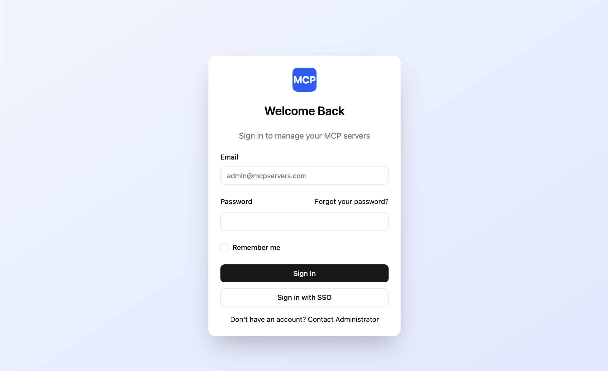
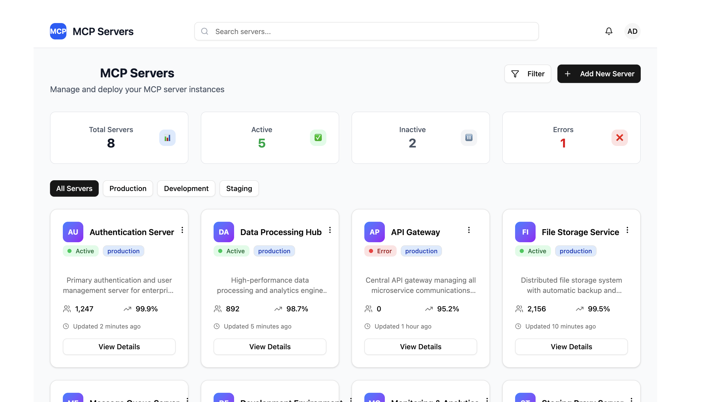
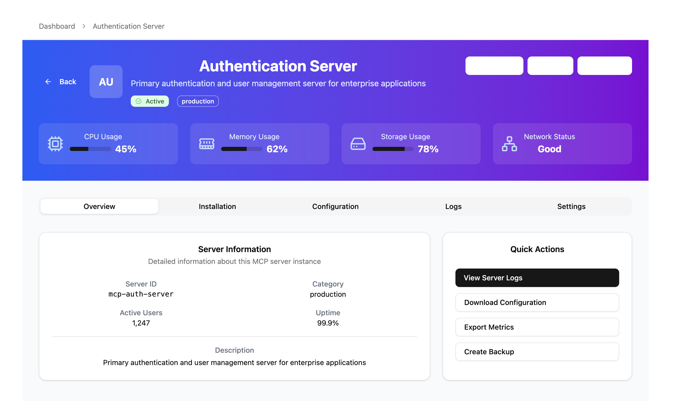

# MCP Server Management UI

This project is a web-based interface for managing MCP servers, built with React, TypeScript, and Vite. It features a modern UI using shadcn/ui.

## Features

- User authentication (mocked)
- Dashboard to view and manage servers
- Detailed server view

## Screenshots

### Login Page


### Dashboard


### Server Detail Page


## Getting Started

1.  **Clone the repository:**
    ```bash
    git clone <repository-url>
    ```
2.  **Install dependencies:**
    ```bash
    pnpm install
    ```
3.  **Run the development server:**
    ```bash
    pnpm dev
    ```

The application will be available at `http://localhost:5173` (or the next available port).

## Project Structure

- `src/components/pages/` - React pages (LoginPage, DashboardPage, ServerDetailPage)
- `src/components/ui/` - shadcn/ui components
- `src/data/` - Mock data for MCP servers
- `public/screenshots/` - Directory for project screenshots

## Technology Stack

- **Frontend**: React 18 with TypeScript
- **Build Tool**: Vite
- **UI Library**: shadcn/ui
- **Routing**: React Router
- **Styling**: Tailwind CSS


